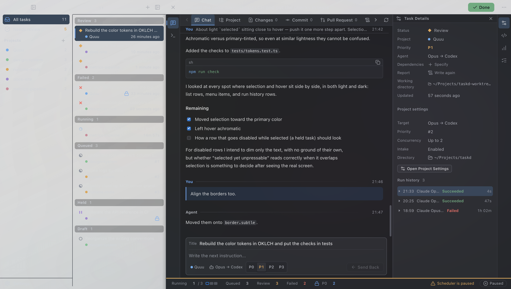

# Quuu AI

> [!WARNING]
> Quuu is an application built by **kinzal, for kinzal**. External changes and pull
> requests are not accepted. Issues may describe bugs or feature requests, but they
> will not be addressed unless kinzal is personally affected by the problem or needs
> the feature.

Quuu brings AI coding agents into one macOS workspace. Queue work across projects,
let agents run unattended, then review the results and send follow-ups without
juggling terminals or losing track of sessions.

- **Run multiple agents:** Claude Code, Codex, Cursor, Grok, GitHub Copilot, Antigravity, and opencode.
- **Control the queue:** priorities, dependencies, concurrency limits, and automatic scheduling.
- **Keep work moving:** automatic fallback on rate limits; agent runs survive app restarts.
- **Review in context:** conversations, code changes, reports, and follow-ups. You decide when work is done.
- **Pick up anywhere:** import terminal sessions, resume them interactively, or review and queue work from iPhone via iCloud.

## Requirement

- macOS on Apple Silicon or Intel.
- At least one supported agent CLI installed and authenticated.

The optional iPhone companion requires iOS 18+, iCloud Drive, and a local Xcode build.

## Install

1. Download `Quuu-<version>-arm64.dmg` (Apple Silicon) or
   `Quuu-<version>-x64.dmg` (Intel) from [Releases](https://github.com/k-kinzal/quuu/releases).
2. Open the DMG and drag `Quuu.app` into **Applications**.
3. Open Quuu. If macOS blocks the first launch, go to
   **System Settings → Privacy & Security → Open Anyway**, then confirm **Open**
   ([Apple's instructions](https://support.apple.com/en-us/102445)).

Enable an agent in **Settings → Agents** and select it for your project to start
queueing work.

See the [guide](docs/guide.md) for configuration, development, and iPhone installation.

## License

[MIT](LICENSE)
