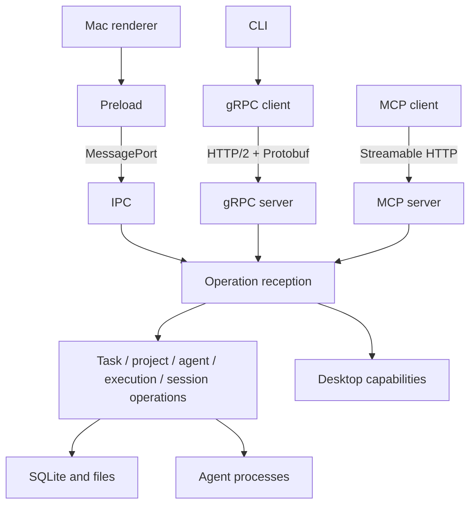

# Quuu structure

Updated 2026-09-27. [Concepts and responsibilities](concepts.md) describes the
project, agent, task, workflow, run, session, automation and review relationships.
The executable boundary rules are in `scripts/architecture/policy.mjs`.

## Priorities

UX and performance determine where work happens. The Mac app calls operations
through its existing MessagePort IPC. HTTP is not in that path. Session ingestion
is incremental and durable; conversation views and external analysis read bounded
pages. State changes are committed before notifications and execution are triggered.

Session observations and verified external effects have distinct contracts.
PR URLs extracted from logs remain candidates until GitHub's head repository/SHA
matches a reflog-attributed task commit. Only verified associations feed PR views,
reports and automatic follow-up; see [the evidence contract](pull-request-evidence.md).

Quuu uses ordinary functions and feature-owned operations. It does not adopt DDD,
Clean Architecture, a generic repository abstraction, or an interface for every
function. Features include actual execution responsibilities. New layers must
protect a concrete boundary rather than multiply forwarding code.

## Distribution and packages

There are three workspaces: `apps/mac`, `apps/mobile`, `packages/design-system`.
The CLI and server client ship with the Mac app. Their source is separated by
responsibility inside that app; Quuu-specific code is not an independent package.

`packages/` is reserved for capabilities that multiple unrelated projects can use
and that can be published independently. The Design System meets that requirement.
A data-independent iCloud synchronization library could also qualify, but no such
library is needed for this change. The existing Mac/iPhone protocol remains owned
by its two implementations and compatibility tests.

## Source layout and direction

```text
apps/mac/src/
  api/                  Public operation schemas, contract, events and generated protocol
    schemas/            Zod request and response declarations
    contract.ts         Complete operation set used by every reception
    generated/          Protobuf-ES descriptors/types and generated wire shapes
  main/
    bootstrap.ts        Assembles long-lived features, timers and their callbacks
    api/                Binds each operation once to its responsible feature
    ipc/                Electron sender validation and MessagePort transport
    servers/            gRPC, MCP, authentication, callers and listener lifetime
    desktop/            Native dialogs, clipboard, window surfaces and menu information
    projects/           Project operations and working-directory resolution
    agents/             Configured agents and groups
    agent-clis/         Provider command syntax
    agent-adapters/     Provider evidence translated for Quuu
    tasks/              Task operations, conditions, dependencies and ordering
    execution/          Capacity, scheduling, launch, cancellation and recovery
    automation/         Recurring work and automatic PR follow-ups
    session/            Indexing, structured history, caller-owned conversation views
    review/             Git/PR observations and review actions
    report/             Task reports and project assessments
    settings/           Preferences and identity
    terminal/           Interactive terminal operations and lifetime
    mobile-sync/        Mac-side file protocol and receipt processing
    db/                 SQLite connection, SQL and migrations
    platform/           Concrete OS, file and process integrations
  preload/              Context isolation and the IPC client
  renderer/             Display, input and local UI state
  client/               Generated-protocol gRPC client; imports no main implementation
  cli/                  CLI parsing, target resolution and streamed log output
apps/mac/proto/          Generated .proto and permanent field-number registry
skills/quuu/            Agent instructions for the installed CLI and MCP server; SKILL.md indexes
                        use-case references/. Bundled into the app as QuuuAI's workspace
apps/mac/quuu-ai/       QuuuAI's workspace: its own AGENTS.md / CLAUDE.md for operating Quuu through
                        the CLI (not the repository's), and a link to skills/; packaged as Resources/quuu-ai
```



`api/` has no implementation or OS dependencies. IPC, the servers and the external
client depend on it. The renderer consumes only API types. The preload cannot
import the network client. Features cannot depend on reception, servers, or
Electron desktop composition. The operation reception has no Electron imports;
its host supplies desktop capabilities and caller lifetime. Servers have no direct
DB or task-operation imports. CLI requests go through `client/`.

CLI help uses Commander and a generated list of operation names. The schema,
gRPC client, query engine and table formatter load only when an action needs them.
The packaged CLI includes its lazy chunks beside the entry point. `api:check`
keeps the lightweight command tree in sync with the operation contract.

All these directions, package manifests, cross-app imports and cycles are checked.
The existing provider-integration and Design System boundaries remain enforced.

## One operation contract

`api/contract.ts` declares inputs, outputs and failures with oRPC and Zod.
`main/api/router.ts` implements that contract once. Both IPC and external callers
enter that router, which calls the owning feature. The generated client types,
MCP tools and Protobuf methods derive from the complete contract. A newly added
operation cannot silently remain desktop-only.

Desktop operations such as opening a native dialog remain desktop operations even
when invoked remotely: they act on Quuu's Mac window. Session views and terminals
are owned separately by each window or authenticated remote caller. Closing one
caller releases its resources without closing another caller's resources.

The app retains its official oRPC MessagePort transport and TanStack Query state.
The external client uses Connect's official gRPC transport with generated
Protobuf-ES descriptors; no custom HTTP/2 or gRPC framing is implemented. The MCP
server uses the official MCP SDK's Streamable HTTP transport. It calls operations
in process, independently of whether the gRPC listener is enabled.

## Generation and compatibility

```sh
npm run api:generate
npm run api:check
```

The generator reads the Zod operation contract and emits a named request, response
and RPC for each operation. Protobuf objects and unions are structured messages;
heterogeneous values such as provider tool input use `google.protobuf.Value`.
Scalars retain presence. Arrays have a wrapper so an omitted patch and an explicitly
empty array remain distinguishable. Unions use `oneof`, including explicit null.
The generated shapes convert the existing IPC values to these protobuf messages.

`proto/field-numbers.json` records permanent field numbers. Never renumber or reuse
one. Removed fields remain reserved. `api:check` verifies regeneration produces
exactly the committed files and runs Buf's breaking-change check against the pinned
v1 descriptor in `tests/fixtures/api/v1.bin`. Do not regenerate that baseline to
make an incompatible change pass. A deliberate incompatible API needs a new version.

The wire protocol is `quuu.v1.Quuu`. `Connect`, `Disconnect` and `Watch` manage a
remote caller and its notifications; the other methods are application operations.
Calls carry bearer authentication and `quuu-client-id`. The TypeScript client
handles this lifecycle and exposes both generated protobuf RPCs and a typed
`api` matching the desktop contract. It never retries mutations automatically.

## Listener and resource lifetime

Settings independently control HTTP and MCP enablement and ports. Port zero picks
an available port. Both listeners bind to `127.0.0.1`. The one listener that binds
every interface is a host's network listener (below). Startup loads network SDKs
after showing the first window. Binding failures are shown in Settings and do not
stop the scheduler, IPC or window. Changing a listener releases its callers;
turning one off does not turn the other off. A settings response is returned before
its own listener is stopped.

`connections.json` in the app's data directory is written atomically with mode
0600. It carries the active endpoints and a random bearer token stored privately in
`server-token` (also 0600). The token survives restarts so configured MCP clients keep
working; use a fixed MCP port for a stable URL. The CLI discovers the current URL
automatically. Shutdown removes the discovery file. MCP checks Host and
Origin as well as authentication. Requests are bounded, remote caller count is
limited, inactive clients expire, and event streams reject a consumer that falls
behind instead of buffering indefinitely.

App shutdown stops listeners and caller resources before closing SQLite. Detached
agent processes, their log descriptors and exit-file recovery remain unchanged.
Restart still re-adopts running agents.

## Hosts and satellites

A satellite's window operates another computer's Quuu through the operation
contract. `main/settings/network.ts` owns the role and credentials (`network.json`,
never the app settings, which a satellite's window reads from its host). The host's
network listener is the same gRPC server with a different admission: each paired
computer's own bearer credential, plus an unauthenticated `Pair` RPC that trades
the code shown on the host for that credential. A host announces itself by UDP
broadcast (`servers/lan.ts`); discovery only suggests an address, and every
operation still authenticates.

`servers/satellite.ts` probes the paired host and opens one host caller per
window, so views and terminals stay owned per window on the host too. The operation
reception forwards through `OperationHost.forwardFor`: `satelliteRoute` answers
desktop, app and network operations locally, refuses operations that would open
the host's files on a screen, and sends everything else to the host. While the
windows show the host, local snapshot, settings, scheduler and toast pushes are
withheld and the host's `Watch` events are delivered instead. Switching sides
reloads the windows rather than reconciling two data sets in the renderer.

## History analysis and performance

`tasks.list` supports project/status/archive filters and stable sequence paging in
SQLite. `logs.page` requests ingestion for one run, waits for the index, then reads
at most 200 messages. An optional search filters that bounded scan; `next` advances
even if no messages matched. The index generation detects invalidated cursors.
Existing indexed history remains readable when a provider log is no longer present.

`quuu tasks logs --all` streams JSONL with backpressure and avoids repeating the
same recorded conversation. It keeps only one page in memory. The history reader
creates no live view subscription, so analysis does not change the person's open
conversation.

The review screen checks saved projection versions every second. `review.poll` returns
only the version when unchanged; changed and initial reads include the full projection.
The original `review.snapshot` remains available, including for satellites following an
older host. Time labels share a clock and render only when their text changes; hiding the
document pauses that display clock without affecting execution or ingestion.

Global snapshots are built for remote clients only when a client is watching, and bursts
are coalesced.

## Verification

The root quality gate includes lint, architecture, generation/compatibility,
TypeScript and tests. The server tests start real ephemeral listeners against an
isolated SQLite database. They exercise the generated gRPC client, built CLI and
SDK MCP client, plus authentication, partial updates, paging, errors, listener
configuration and caller-owned resources. The pinned descriptor protects old
consumers, and existing IPC/window, scheduler/restart and mobile compatibility
regressions continue to run.

Screen checks use the fixture app described in [verification.md](verification.md).
No verification writes to production tasks. Finish in the order check, commit,
app restart and screen inspection.

## Lifecycle hooks

`main/hooks` owns field inheritance, queued auxiliary executions and the built-in
report dispatch. Persistence emits lifecycle facts through a registered recorder;
configured work is inserted in the same transaction, while launch and notifications
wait for commit. `hook_runs` retains immutable inputs and working directories even
after task deletion. `hook_pending_reports` preserves the built-in review request
until custom hooks finish. Reports retain their separate artifact contract and do
not occupy task capacity.

Auxiliary runs never enter `runs`, change task lineage, or advance task state.
The scheduler respects pending hooks per project, and completion waits for its
before-complete hooks before integrating a managed worktree. Detached shell wrappers
leave a pid and exit file for restart recovery; an ambiguous start is not replayed.
Expanded conversations use `session/auxiliaryLogs` and the durable session index, with
bounded pages and separately scoped images. Auxiliary reads create no selected task view
and derive no task state or review evidence. The original preview API remains compatible. Import excludes auxiliary sessions so they do not become
new tasks that recursively launch hooks.

## Remote Runner execution

`main/runners/operations` owns pairing grants, advertised capabilities, durable
dispatch and result ingestion. The scheduler still chooses eligible agents and
owns task transitions. `execution/runner`, hooks, reports and review ask this
feature to execute an instruction when a task has a remote workspace.

The standalone Node entrypoint under `main/runners/entry` polls a pinned HTTPS
controller, journals instruction IDs and launches a separate process per job.
An acknowledged byte offset makes log delivery repeatable after reconnection;
an interrupted job is reported without replaying its instruction. A task remains
bound to its original checkout and Runner. Remote PIDs never enter local process
recovery. SQL and schema upgrades remain in `db`.

GitHub installation tokens travel separately from durable instruction records.
Quuu reads the App key from its own Keychain and scopes each token to the task's
repository. The worker writes temporary GitHub CLI credentials and receives
refreshes while the controller is connected. Project toolchains belong to the
image user's runtime setup.

Agent sign-in never copies the controller's own login, because rotating refresh tokens
make two holders sign each other out. Every agent takes one path: the controller runs the
agent's own browser sign-in into a throwaway home (Claude Code's through the native PTY
helper, since it renders its token only on a terminal), delivers the result once to exactly
one Runner outside the job journal, and forgets it after the Runner confirms. The Runner
owns the credential from then on. Workers report whether each agent has a credential, and
routing skips agents without one. `runners/agentAuth` is the one place that knows what each
agent's sign-in produces and where a Runner keeps it.

## QuuuAI assistant

`main/assistant` owns bounded shared memory, proposals, reactions, read receipts and research
context. The scheduler offers it spare capacity only after ordinary eligible tasks. Research
is an internal task so the existing runner owns slots, logs, process recovery and cancellation;
internal checks are excluded from user task lists, mobile export, lifecycle hooks and ordinary
completion notifications. A durable check record identifies its JSON result and prevents replay
on restart. Validated proposals create visible chat threads. Reactions record mutable feedback without changing proposal acceptance or task state. Explicit
`assistant.createTask` saves a creation receipt atomically with normal task creation; retries
return that receipt, including after restart. Legacy reactions migrate as data only, preserving
existing task links. Discussion and feedback remain in the proposal history. No automatic operation marks work done.

Conversation turns register their run identity in `assistant_turns`; `assistant.noReply`
records an explicit per-attempt decision. The runner validates opted-in successful results
against the durable session index before committing completion or releasing capacity. Local,
remote and recovered exits use the same path, and the exit receipt survives until settlement.
A unique turn marker in the injected prompt prevents previous replies from satisfying a new
turn, even in timestamp-free logs. Missing or unverifiable results fail separately from
intentional silence. Assistant read revisions follow reply content rather than run or index
status, so silent turns neither re-notify nor consume earlier unread replies.
