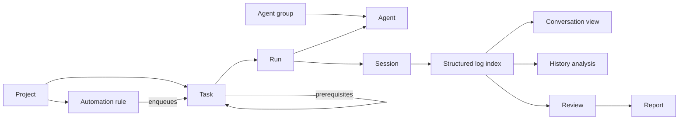

# Quuu concepts and responsibilities

Quuu coordinates real agent processes and the human's review of their work. Its
structure follows those responsibilities. UX and performance take priority over
structural uniformity. There is no DDD or Clean Architecture layer template.

| Concept | Responsibility and owner | Relationships |
|---|---|---|
| Project | Working directory, agent selection, concurrency, priority, identity and project settings. `main/projects` | Has tasks and automation rules. Chooses one agent or group. The built-in QuuuAI backing project (`projects/builtIn`) operates Quuu itself: it always exists, cannot be deleted, and runs in the app's bundled workspace. On the Mac, QuuuAI is a single conversation channel above All tasks. Each task is a thread. Shared memory and idle-capacity research belong to `main/assistant`; proposals become project tasks only through the explicit Create task action; reactions record feedback independently. |
| AI agent | Executable configuration, model arguments, environment, concurrency and fallback. `main/agents` | Used by runs; definitions may belong to groups. Editing a definition does not reinterpret recorded runs. |
| Agent group | Selects among configured agents by priority, round robin or load. `main/agents` | Projects and report writers can select a group. |
| CLI implementation | Actual command syntax and invocation defaults. `main/agent-clis` | Knows its provider CLI; knows no Quuu task or persistence. |
| Agent integration | Converts provider sessions, output, errors, limits and liveness into Quuu's execution and log information. `main/agent-adapters` | Connects execution/import/indexing to a CLI. Provider formats remain private here. |
| Task | A request, its project, priority, prerequisites, unsent follow-up, reservation and review decision. `main/tasks` | Has many runs. Carries the established CLI lineage across them. |
| Task workflow | Valid transitions, prerequisite checks and follow-up behavior. `tasks/conditions`, `tasks/ordering`, task operations and `execution` | A dependency waits for a run to finish or for human approval. Queueing, acquisition, completion and approval have different owners and conditions. |
| Task worktree | Persistent task checkout and integration at human approval. `main/tasks/worktrees` | Global setting plus project override; created before first launch, reused across runs and restarts, retained on archive, integrated on Done, discarded on delete. Runs record its working directory. |
| Run | One concrete attempt: agent, process, session identity, files, timestamps and outcome. `main/execution` | Belongs to one task and one chosen agent; several runs may continue one session. |
| Scheduler | Acquires capacity, respects prerequisites/cooldowns, applies run outcomes and recovers after restart. `main/execution` | Coordinates tasks, agents and runs; uses task operations to record changes. |
| Runner | Launches, observes and cancels actual process groups. `main/execution/runner` | Agents stay detached and write to log files, so app restart does not cancel them. |
| Session | A provider conversation continued across runs. `main/session` | Session identity is not run identity. Provider identity and log location identify its history. |
| Structured session log | Parsed messages, tool calls/results, images and metadata. `main/session/types` | The persistent index feeds conversation views, historical analysis and derived review evidence. Consumers do not parse provider files again. |
| Session view | One caller's selected run, page range and notifications. `main/session/view` | Owned by a window or external client; independent of app-wide indexing. |
| Session history | Stateless bounded reads and search of the durable index. `main/session/history` | CLI analysis can scan old runs without disturbing a person's selected conversation. |
| Automation rule | Conditions and instructions that enqueue ordinary tasks. `main/automation` | Belongs to a project. Time, idle and duplicate gates combine; no parallel task execution mechanism. |
| Review | Evidence about commits, files and PRs, plus actions on that evidence. `main/review` | Derived from indexed sessions and Git/GitHub observations. Human approval remains a task operation. |
| Lifecycle hook | Configurable auxiliary AI or command run on a task event. `main/hooks` | Inherits each setting independently from global to project; separate history and sessions; before-completion hooks finish before worktree integration. |
| Report | A separately generated explanation of task changes or project progress. `main/report` | Has its own writer and artifacts; does not take a task's execution slot or change its state. |
| Terminal | A caller's interactive shell and its lifetime. `main/terminal` | Uses the task's observed working directory. Another caller cannot drive it. |
| Settings | App preferences and identity, including external listener configuration. `main/settings` | Stored independently of window lifetime. Listener status records actual binding success or failure. |
| Mobile sync | Mac snapshots, iPhone requests, receipts and conflict checks. `main/mobile-sync` and the phone's protocol end | Applies requests through the same task operations. Transporting files does not decide task behavior. |

## Task and execution relationships

Normal work execution ends in review, failed or waiting for a limit. Only an explicit
human decision approves work as done. QuuuAI threads reuse task/run storage for history and
continuation, but their successful turns finish without work approval. The stored `review`
state is a resumable conversation boundary, not an outstanding human review. Threads never
enter ordinary work lists or counts, even when an older version marked one done.
Continuing a session preserves its CLI.
An explicit per-task agent selection remains binding while capacity is occupied.
All communication paths use these same conditions and side effects.
